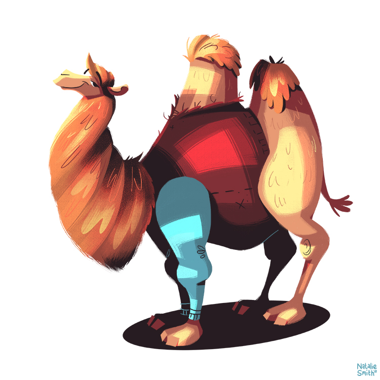

# CamelusMips

Yet Another MIPS Emulator.

## Instructions Supported

- R-type: addu, add, subu, sub, and, or, xor, nor, sltu, slt, sllv, srlv, srav, jr, sll, srl, sra
- I-type: addiu, addi, andi, ori, xori, lui, lw, sw, beq, bne, sltiu, slti
- J-type: j, jal

## Road Map

- [x] Assembler
- [ ] Basic GUI
- [ ] MIPS 5-stage pipeline CPU core
- [ ] Peripheral 
    - [ ] VGA
    - [ ] PS2 keyboard
    - [ ] Serial port
    - [ ] Ethernet
- [ ] Advanced GUI
- [ ] Command line tools
